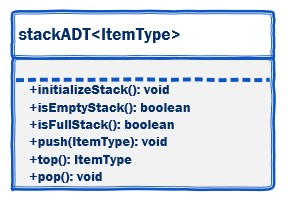
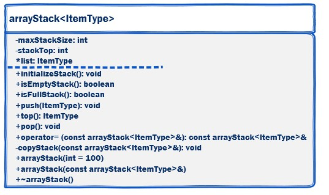
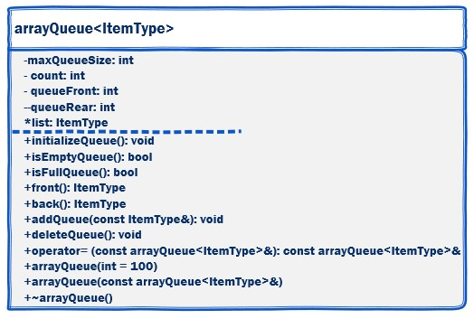

# Week 04 — Lesson: Stack ADT, Expression Notation, Queue ADT

---

## 🎯 Learning objectives

- Explain the **Stack** (LIFO) and **Queue** (FIFO) ADTs and their common operations
- Implement an **array-based** Stack and Queue (including special members: copy ctor, assignment, destructor)
- Convert and evaluate arithmetic expressions using **infix / prefix / postfix** notation and a stack-based evaluator
- Write tester programs and validate edge cases

---

## 📚 Overview — ADT recap

- **Stack** — Last In, First Out (LIFO). Real-world analogy: a stack of plates.
- **Queue** — First In, First Out (FIFO). Real-world analogy: people in line.
- Many compilers and calculators convert infix expressions to **postfix (RPN)** because postfix is easy to evaluate with a stack.

---

## Section 1 — Stack ADT (LIFO)

### Definition
A stack stores elements in LIFO order: the last item pushed is the first popped.


### Interface & operations
Common `stackADT` operations you should provide:
- `initializeStack()` — reset to empty
- `isEmptyStack()` — returns true when empty
- `isFullStack()` — returns true when full (array impl.)
- `push(const ItemType&)` — add an item
- `top()` — read item at the top (no removal)
- `pop()` — remove top item

> `stackADT` should be an abstract class (pure virtual methods). Concrete classes (e.g. `arrayStack`) implement the methods.



### Array-based stack (concept)
UML / important members:
- Attributes: `maxStackSize`, `stackTop`, `*list` (dynamic array)
- Constructors / special members: `arrayStack(int=100)`, copy ctor, `copyStack()`, destructor, `operator=`



### Tester programs
- `arrayStackTester.cpp` — push/pop/top/copy/assignment/boundary tests

---

## Section 2 — Expression notation (infix / prefix / postfix)

Expressions can be represented in different notations, which affect how operators and operands are arranged. These notations are commonly used in programming, especially when evaluating expressions using stacks.

- infix: normal arithmetic (a + b)
- prefix: operator before operands (`+ a b`)
- postfix (RPN): operator after operands (`a b +`)

### Examples

| Infix | Prefix | Postfix |
|:---|:---:|:---|
| a + b | + a b | a b + |
| a + b * c | + a * b c | a b c * + |
| a * b + c | + * a b c | a b * c + |
| (a + b) * c | * + a b c | a b + c * |
| (a-b) * (c + d) | * - a b + c d | a b - c d + * |
| (a + b) * (c - d / e) + f | + * + a b - c / d e f | a b + c d e / - * f + |
| a - b + c | + - a b c | a b - c + |
| a / b * c + d | + * / a b c d | a b / c * d + |
| (a + b) / (c - d) | / + a b - c d | a b + c d - / |
| a ^ b + c | + ^ a b c | a b ^ c + |

---

### Expression Notations: Infix, Prefix, and Postfix

Expressions can be represented in different notations, which affect how operators and operands are arranged. These notations are commonly used in programming, especially when evaluating expressions using stacks.

#### Infix Notation

Infix notation is the most common form, where the operator is placed between the operands. For example:

- `a + b` (addition)
- `(a * b) + c` (multiplication and addition with parentheses for precedence)

This notation requires knowledge of operator precedence and associativity to evaluate correctly.

#### Prefix Notation (Polish Notation)

In prefix notation, the operator precedes the operands. For example:

- `+ a b` (equivalent to `a + b`)
- `+ * a b c` (equivalent to `(a * b) + c`)

This notation eliminates the need for parentheses and precedence rules, as the structure is unambiguous.

#### Postfix Notation (Reverse Polish Notation)

In postfix notation, the operator follows the operands. For example:

- `a b +` (equivalent to `a + b`)
- `a b * c +` (equivalent to `(a * b) + c`)

Like prefix, it avoids parentheses and is easy to evaluate using a stack: operands are pushed onto the stack, and operators pop the required operands, perform the operation, and push the result back.

#### Why Use Prefix or Postfix?

Prefix and postfix notations are useful in compilers and calculators because they simplify parsing and evaluation without needing to handle operator precedence explicitly. Algorithms like the shunting-yard algorithm convert infix to postfix for easier computation.

---

Why this matters: many compilers convert infix to postfix — postfix can be evaluated with a single stack.

Example: (6 + 3) * 2  →  postfix: `6 3 + 2 *`


### Worked examples (from the lecture HTML)

#### Example 1 — (6 + 3) * 2

- Infix: `(6 + 3) * 2`
- Prefix: `* + 6 3 2`
- Postfix: `6 3 + 2 *`

Postfix evaluation (step-by-step using a stack):

1. Push 6 onto stack
2. Push 3 onto stack
3. Operator `+`: pop 3 and 6, compute `6 + 3 = 9`, push 9
4. Push 2
5. Operator `*`: pop 2 and 9, compute `9 * 2 = 18`, push 18

Result (final stack): 18

Prefix evaluation (visual — process right to left):

```text
1. Push 2:
+---+
| 2 |
+---+

2. Push 3:
+---+
| 3 |
+---+
| 2 |
+---+

3. Push 6:
+---+
| 6 |
+---+
| 3 |
+---+
| 2 |
+---+

4. Encounter '+': pop 6 and 3, compute 6 + 3 = 9, push 9:
+---+
| 9 |
+---+
| 2 |
+---+

5. Encounter '*': pop 9 and 2, compute 9 * 2 = 18, push 18:
+---+
| 18|
+---+

Result: 18
```

Postfix evaluation (visual — process left to right):

```text
1. Push 6:
+---+
| 6 |
+---+

2. Push 3:
+---+
| 3 |
+---+
| 6 |
+---+

3. '+': Pop 3 and 6, 6 + 3 = 9, push 9:
+---+
| 9 |
+---+

4. Push 2:
+---+
| 2 |
+---+
| 9 |
+---+

5. '*': Pop 2 and 9, 9 * 2 = 18, push 18:
+---+
| 18|
+---+

Result: 18
```

> Visual summary: `6 3 + 2 *` → push 6, push 3, + → push 9, push 2, * → 18


#### Example 2 — 4 * 5 + 6

- Infix: `4 * 5 + 6`
- Prefix: `+ * 4 5 6`
- Postfix: `4 5 * 6 +`

Prefix evaluation (visual — process right to left):

```text
1. Push 6:
+---+
| 6 |
+---+

2. Push 5:
+---+
| 5 |
+---+
| 6 |
+---+

3. Push 4:
+---+
| 4 |
+---+
| 5 |
+---+
| 6 |
+---+

4. '*': Pop 4 and 5, 4 * 5 = 20, push 20:
+---+
| 20|
+---+
| 6 |
+---+

5. '+': Pop 20 and 6, 20 + 6 = 26, push 26:
+---+
| 26|
+---+

Result: 26
```

Postfix evaluation (visual — process left to right):

```text
1. Push 4:
+---+
| 4 |
+---+

2. Push 5:
+---+
| 5 |
+---+
| 4 |
+---+

3. '*': Pop 5 and 4, 4 * 5 = 20, push 20:
+---+
| 20|
+---+

4. Push 6:
+---+
| 6 |
+---+
| 20|
+---+

5. '+': Pop 6 and 20, 20 + 6 = 26, push 26:
+---+
| 26|
+---+

Result: 26
```

> Visual summary: `4 5 * 6 +` → 26


You can use these worked examples in your tester or write a small driver that prints the conversion and evaluation steps for verification.


You can use these worked examples in your tester or write a small driver that prints the conversion and evaluation steps for verification.

---

## Section 3 — Queue ADT (FIFO)

### Definition
A queue stores elements in FIFO order: the first item added is the first removed (like a line at the bank).


### Interface & operations
Common `queueADT` operations:
- `initializeQueue()`
- `isEmptyQueue()`
- `isFullQueue()`
- `front()` — read front item
- `rear()` — read rear item
- `addQueue(const ItemType&)` — enqueue
- `deleteQueue()` — dequeue

> `queueADT` is abstract; concrete classes (arrayQueue / linkedQueue) implement behavior.

### Array-based queue (concept)
Attributes and behaviour for array implementation:
- `maxQueueSize`, `count`, `queueFront`, `queueRear`, `*list`
- Use modulo arithmetic for circular buffer behavior
- Special members: constructor, copy ctor, destructor, `operator=`



Tester: `testProgQueueArray.cpp` — exercise add/delete/front/rear and boundary cases.

---

## ✅ Lab — this week's assignment (Queue: remove(n))

Assignment summary:

- Modify the **Queue ADT** to add a method `void remove(int n)` that removes and discards the first `n` entries from the queue (the items at the front).
- Update the provided **array-based Queue** implementation to implement `remove(n)`.
- Extend the queue tester program to exercise `remove(n)` for normal and boundary cases.

Detailed requirements and expectations:

- API change: Add `void remove(int n);` to `queueADT.h`.
- Behavior specification (required for grading):
  - If `n <= 0` the method should be a no-op (do nothing).
  - If `0 < n < size()` remove the first `n` elements in FIFO order.
  - If `n >= size()` the queue becomes empty.
  - The method should not leak memory and must preserve queue invariants (`count`, `queueFront`, `queueRear`, etc.).
- Implementation notes:
  - Use the lecture-provided arrayQueue implementation as the starting point; add `remove(n)` in `arrayQueue.cpp`/`arrayQueue.h` (or `linkedQueue` if you prefer linked implementation, but use the class code given in lecture).
  - Ensure `remove(n)` runs in O(n) time and uses the existing circular indexing logic.
  - Update copy ctor / assignment / destructor as needed (no extra heap objects should be left dangling).

Required files to submit (place in a single archive):

- `queueADT.h` (interface with `remove(int n)` added)
- `arrayQueue.h`, `arrayQueue.cpp` (updated implementation)
- `arrayQueueTester.cpp` or `testProgQueueArray.cpp` (tester updated to include `remove(n)` tests)
- `README.md` (brief build & run instructions and expected tester output)

Suggested test cases to include in your tester (must be in the submitted tester):

1. remove(0) on a non-empty queue — no change expected
2. remove(1) — removes a single front element
3. remove(k) where 1 < k < size — removes exactly k elements
4. remove(size) — results in empty queue
5. remove(larger-than-size) — results in empty queue (graceful handling)
6. call remove repeatedly until queue is empty
7. verify `front()`/`rear()`/`isEmptyQueue()`/`count` after removals

Build & run (example):

```bash
# compile
g++ -std=c++17 lab-info/week04/src/arrayQueue.cpp lab-info/week04/src/arrayQueueTester.cpp -o lab-info/week04/src/arrayQueueTester
# run
./lab-info/week04/src/arrayQueueTester
```

Submission instructions:

- Zip all required files (`.zip`, `.7z` or `.rar`) and upload the archive for grading.
- Include a short README describing how to build and run the tester and list which test cases you covered.

Grading checklist (what I will look for):

- `queueADT.h` contains `void remove(int n);`
- `arrayQueue` correctly implements `remove(n)` and preserves queue invariants
- Tester covers the suggested cases and demonstrates correct behavior
- No memory leaks (destructor and copy/assignment remain correct)

Place your source files in `lab-info/week04/` (recommended).

---

## 🔧 How to compile & run (examples)

From the repository root (examples use g++ — adjust for your environment):

- Build & run array stack tester

```bash
g++ -std=c++17 lab-info/week04/arrayStack.cpp lab-info/week04/arrayStackTester.cpp -o arrayStackTester
./arrayStackTester
```

- Build & run queue tester

```bash
# compile
g++ -std=c++17 lab-info/week04/src/arrayQueue.cpp lab-info/week04/src/arrayQueueTester.cpp -o lab-info/week04/src/arrayQueueTester
# run
./lab-info/week04/src/arrayQueueTester
```

- Convert infix -> postfix and evaluate (single-file example)

```bash
g++ -std=c++17 lab-info/week04/infix_to_postfix.cpp lab-info/week04/postfix_eval.cpp -o expr_eval
./expr_eval "(6+3)*2"
# expected output: 18
```

If you prefer, add your files to the CMakeLists or create a simple Makefile target.

---

## 💡 Hints & common pitfalls

- Off-by-one on `stackTop` / `queueRear` — carefully define whether `stackTop` is an index to the top element or one past it
- For `arrayQueue` implement circular indexing: `(index + 1) % maxQueueSize`
- Deep copy required for copy constructor & assignment operator — allocate fresh memory and copy contents
- Always implement a destructor to release dynamic memory
- Test edge cases: push when full, pop/delete when empty, copy/assign non-empty containers

---

## ✍️ Submission & grading

- Commit your files to your repository (create a branch named `week04/<your-name>`)
- Push and submit the GitHub/Canvas link per the assignment instructions
- Include a short README in `lab-info/week04/` describing test commands and any known issues

Suggested commit message: `week04: implement arrayStack, arrayQueue, and expression evaluator`

---

## ⚙️ Want starter code or automated tests?
If you want, I can add starter header/CPP files and simple unit testers to the repo — tell me which files to create and I’ll add them.

---

## Appendix — Original Canvas HTML (converted)

> The lesson above is a cleaned/combined version of the Canvas pages (Stack, Expression Notation, Queue). If you need the raw HTML from Canvas, tell me and I will paste it here.

---

### References
Malik, D. (2018). C++ Programming: Program Design Including Data Structures (5th ed.), Chapter 17.


